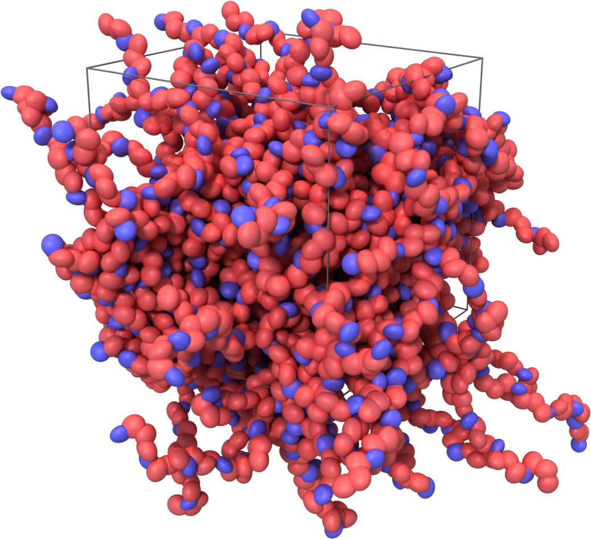
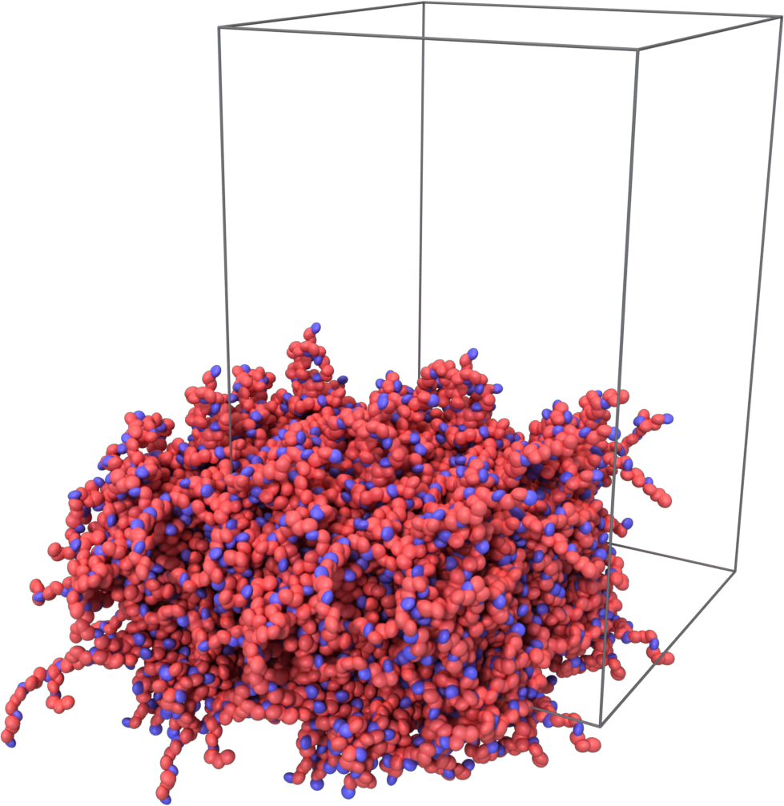
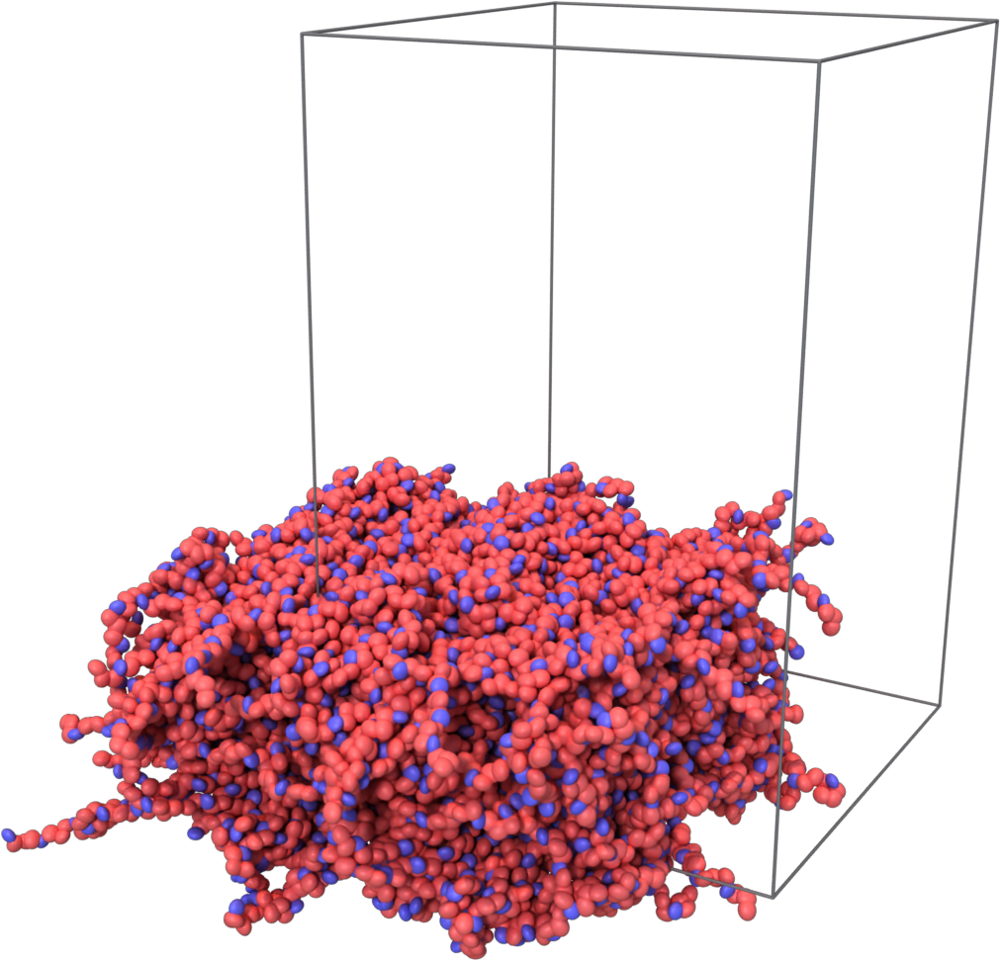
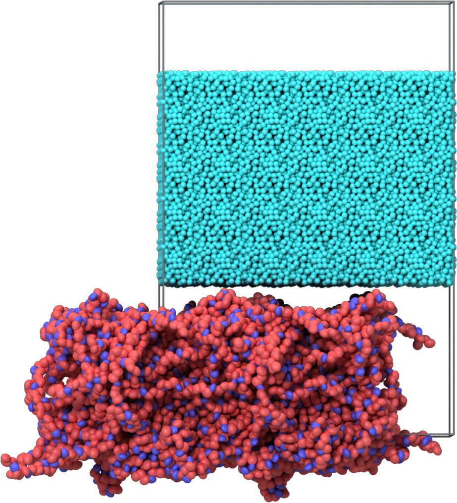
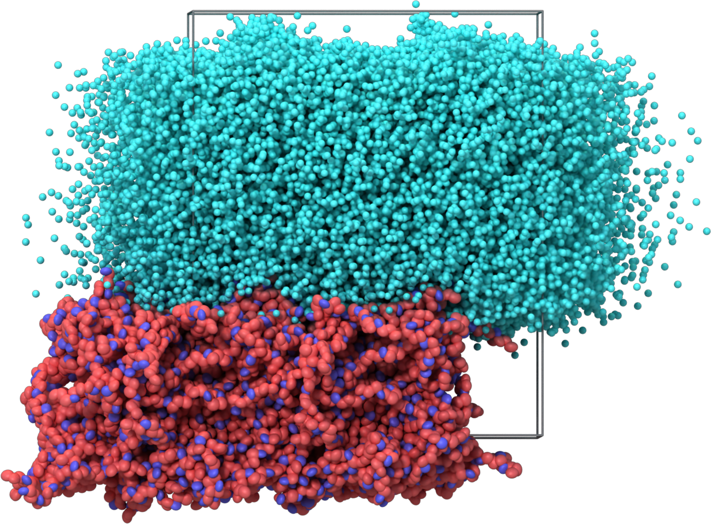
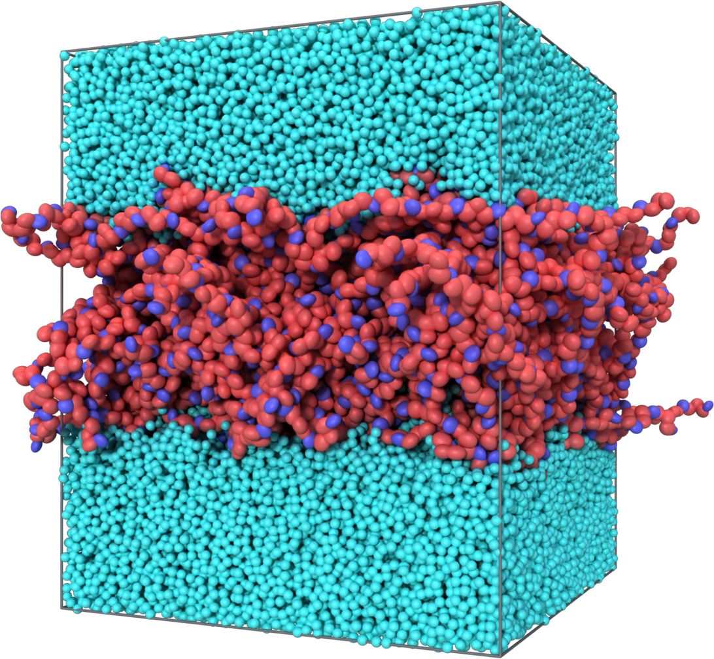
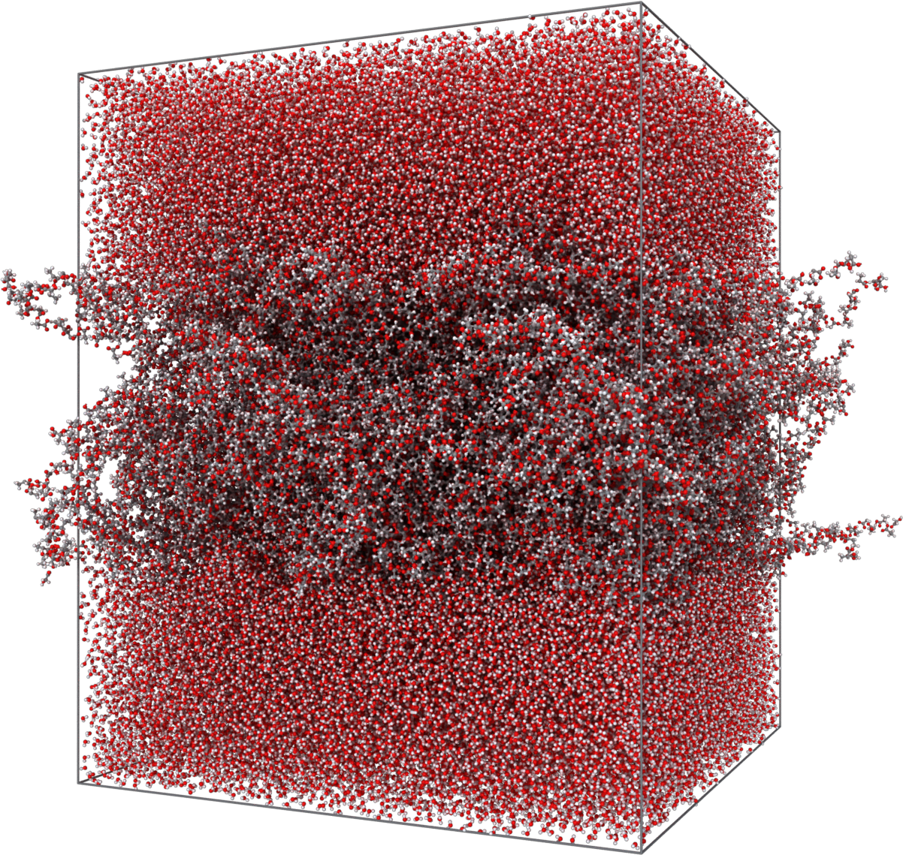
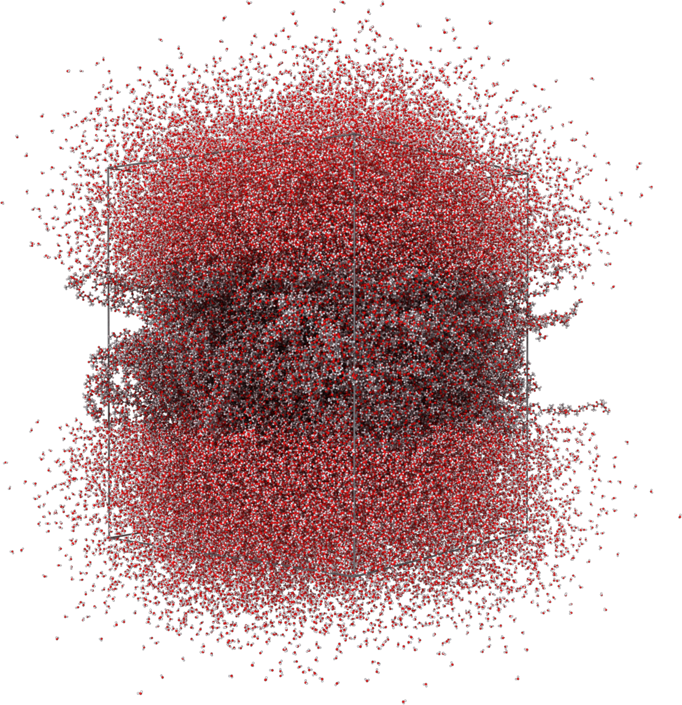

Mesoscopic Multiscale Simulationations
==

###  Description

This Use Case for the [OpenModel](https://open-model.eu/) project describes the creation of a 2D-periodic membrane of poly-lactic-glycolic-acid (*PLGA*) surrounded by water (*TIP4P 2005* model). The workflow starts with a coarse-grained force field based on the [**MOLC**](https://doi.org/10.1039/c9cp04120f) model, implemented in a fork of [**LAMMPS**](https://lammps.org), version [30 Oct 2019](https://github.com/matteoeghirotta/lammps-30Oct19).
The sample is first assembled in the desired configuration, annealed, and then converted to
atomistic coordinates with the program [**BACKMAP**](https://github.com/matteoeghirotta/backmap_legacy), and
finally annealed with a type-I atomistic force field (*OPLS*). The resulting structure is suitable to run
ab-initio calculations (paper in preparation). However, this last step is already an established procedure
and is not covered here.

The whole procedure is based on open-source software and relies on a coarse-grained force field parametrised
consistently with the atomistic force field. Since LAMMPS has limited capabilities to handle complex structure,
the strategy used here is to manipulate molecular samples with a custom-written program, [**dumptools**](./scripts/dumptools.pl), and to combine the structure with the force field using [MOLTEMPLATE](https://github.com/jewettaij/moltemplate).

### Software Dependency

This Use Case depends on the following software. Additional scripts are included in the
[scripts](./scripts/) folder.
1. [MOLTEMPLATE](https://github.com/jewettaij/moltemplate).
2. [LAMMPS 30 Oct 2019](https://github.com/matteoeghirotta/lammps-30Oct19), including the USER-MOLC package.
3. [BACKMAP](https://github.com/matteoeghirotta/backmap_legacy).
4. [VMD](http://www.ks.uiuc.edu/Research/vmd/).

### Workflow

Go to the [multiscale](./multiscale/) folder and execute the following commands.

1. Create a 2x2x1 supercell from the bulk model the polymer, turn it into a slab, and create the input files
   for the first molecular dynamics simulation.  
   | Amorphous bulk structure of PLGA |
   | --- |
   |   |
   ```sh
   bash 01_preprocess.sh
   ```
2. Anneal the slab in vacuum. LAMMPS is typically executed in parallel, depending on the architecture on which it has been compiled. A batch script for the SLURM workload manager is also provided as an example of usage on HPC facilities.
   ```
   mpirun -np 128 lmp_bin -in 02_cg_slab_01.in
   ```
   | Initial structure | Relaxed structure |
   | --- | --- |
   |  |  |
3. Create a supercell of solvent big enough to fill the simulation cell containing the slab. Trim the solvent supercell as to avoid bad contacts with the polymer slab. Write the input files for the next CG-MD simulation.
   ```sh
   bash 03_postprocess.sh
   ```
4. Relax the structure along Z (i.e. the direction perpendicular to the slab surface).
   ```
   mpirun -np 128 lmp_bin -in 04_cg_sample_01.in
   ```
   | Initial structure | Relaxed structure |
   | --- | --- |
   |  |  |
5. Wrap the last frame of the CG structure and patch the bead types as to distinguish between the initial and final monomers in the polymer chain. Convert the wrapped structure to atomistic coordinates and write the input files for the following all-atom MD simulation.
   ```sh
   bash 05_postprocess.sh
   ```
   | Wrapped CG structure | Backmapped atomistic structure |
   | --- | --- |
   |  |  | 
6. Anneal the structure at room temperature. This simulation is computationally quite expensive.
   ```
   mpirun -np 1280 lmp_bin -in 04_cg_sample_01.in
   ```
7. Extract the last (relaxed) snapshot from the binary MD trajectory, and save it as a PDB file for later use.
   ```sh
   bash 07_postprocess.sh
   ```
   

